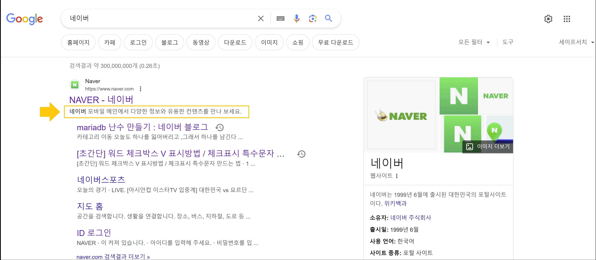

## 용어 설명
 
#### 색인
> Google에서는 알고 있는 모든 웹페이지를 색인에 저장합니다. 각 페이지의 색인 항목은 해당 페이지의 콘텐츠 및 위치(URL)를 명시합니다. Google에서 페이지를 가져와서 읽고 색인에 추가하면 색인이 생성됩니다.

#### 크롤링
> 신규 또는 업데이트된 웹페이지를 찾는 프로세스입니다. Google은 링크를 따라가거나, 사이트맵을 읽거나, 다른 여러 방법으로 URL을 찾아냅니다.   
> (예시) Google은 웹을 크롤링하여 새 페이지를 찾은 다음 필요한 경우 색인을 생성한다.

#### 크롤러
> 웹에서 페이지를 크롤링(가져오기)한 다음 색인을 생성하는 자동 소프트웨어입니다.

#### Googlebot
> Google 크롤러의 일반적인 이름입니다.

#### SEO(Search Engine Optimization)
> 검색엔진 최적화, 즉 검색엔진에서 찾기 쉽도록 사이트를 개선하는 프로세스입니다. 검색엔진 최적화 작업을 하는 사람의 직책을 의미하기도 합니다.

<br>

## SEO 적용 절차
### 1. SEO 적용할 적절한 URL 선택하기   
적절한 도메인이름 정하고 DNS 서버에 등록합니다.   
이 작업이 번거로울 시, 도메인 관리 대행 업체에 문의할 수도 있습니다.   
(예시) `https://baby-hippo.github.io/`


### 2.고유하고 정확한 페이지 제목 만들기
```html
<!DOCTYPE html>
<html>
  <head>
    <title>여기에 제목을 적습니다.</title>
  </head>
</html>
```

#### 구글에서 권장하지 않는 제목 요소
1. 절반이 비어 있는 제목 
2. 더 이상 사용되지 않는 제목 
3. 부정확한 제목 
4. 중복된 제목


### 3.스니펫 작성하기
> 스니펫 : 검색결과에서 시선을 끄는 설명
{: .prompt-tip }

```html
<!DOCTYPE html>
<html>
  <head>
  <meta name="description" content="여기에 해당 페이지 설명을 적습니다.">
  </head>
</html>
```

- 스니펫에는 웹사이트 또는 비즈니스의 이름을 명시할 수 있으며 비즈니스가 실제로 위치한 장소나 주로 다루는 항목, 주요 품목 등 중요한 정보를 포함할 수도 있습니다.
- 페이지 콘텐츠를 정확하게 설명하고, 요약해야합니다. 
- 페이지의 `<meta name="description">` 태그가 순수하게 페이지 콘텐츠에서 가져올 수 있는 내용보다 더 정확한 설명을 사용자에게 제공한다고 판단되는 경우, Google에서는 이를 사용하여 검색 결과에 스니펫을 생성하기도 합니다.
- 메타 설명 태그(`<meta>`)는 일종의 홍보 문구입니다.
- 길이에 제한이 없지만 너무 길면 글씨가 잘릴 수 있습니다.
- 각 페이지마다 고유한 설명 사용하는 것이 좋습니다.


### 4.구조화된 데이터 마크업 추가하기
> 구조화된 데이터 : 사이트 페이지에 추가할 수 있는 코드
{: .prompt-tip }

검색엔진에 콘텐츠를 설명해주기 때문에 검색엔진이 페이지에 어떤 내용이 있는지 더 잘 이해할 수 있습니다. 이를 바탕으로 검색엔진은 유용하고 눈에 잘 띄는 방식으로 콘텐츠를 검색결과에 표시할 수 있습니다. 따라서 내 비즈니스에 맞는 고객을 유치하는 데 도움이 됩니다.

- [Google 검색결과에 사이트가 표시되는 방식 관리하기](https://developers.google.com/search/docs/appearance/structured-data/search-gallery?hl=ko){:target="_blank"}
- [리치 검색 결과 테스트](https://search.google.com/test/rich-results?hl=ko){:target="_blank"}


### 5. 사이트를 모바일 친화적으로 만들기
1. 모바일 전략 선택하기 
   - 반응형 웹 디자인 (권장)
   - 동적 게재 
   - 별도 URL

2. 색인이 정확하게 생성될 수 있도록 모바일 사이트 구성하기 (선택)
   - 반응형 웹 디자인을 사용하는 경우 meta name="viewport" 태그를 사용하여 브라우저에 콘텐츠 조정 방법을 알립니다. 
   - 동적 게재를 사용하는 경우 Vary HTTP 헤더를 사용하여 사용자 에이전트에 따라 변경사항을 알립니다. 
   - 별도의 URL을 사용하는 경우 rel="canonical" 및 rel="alternate" 요소가 있는 `<link>` 태그를 페이지에 추가하여 두 URL 간의 관계를 알립니다.

3. 모바일 친화성 테스트
   - [모바일 친화성 테스트](https://search.google.com/test/mobile-friendly?hl=ko){:target="_blank"}


### 6. 사이트가 색인에 포함되어 있는지 확인하기
1. Google 색인 확인 
   - 검색창에 `site:` 를 이용하여 라고 검색해서 색인여부 확인할 수 있습니다. 
   - 색인이 안되어 있다면 검색결과에 일치하는 검색결과가 없다고 뜹니다.
   - (예시) site:naver.com


### 7. 여러가지 메타태그(meta tag)를 이용하여 검색엔진최적화(SEO) 적용
> 메타 태그(meta tag) :  웹페이지가 담고 있는 컨텐츠가 아닌 웹페이지 자체의 정보를 명시하기 위한 목적으로 사용되는 HTML 태그
{: .prompt-tip }

- Google에 검색어를 입력하면 파란색 글자 (제목 태그 또는 SEO 제목)와 그 아래 검은색의 짧은 문구 (메타 설명) 로 이루어진 형식을 볼 수 있는데, 이 두개를 합쳐서 메타데이터 라고 합니다.

- 메타태그는 HTML 문서 내에서 <head> 요소 아래 배치됩니다. 
- 일반 유저가 보게 되는 웹페이지의 컨텐츠에는 아무 영향을 주지 않습니다. 
- 검색엔진과 같은 기계들이 웹페이지를 읽어야 할 때는 메타 태그의 내용들이 해당 서비스에서 어떻게 표시될지를 결정하는 매우 핵심적인 요소입니다.


#### SEO 태그
```html
<meta name="title" content="웹페이지의 제목">
<meta name="description" content="웹페이지의 상세 설명"/>
<meta name="keywords" content="검색엔진을 위한 키워드" />
<meta name="author" content="문서의 저자" />
```


#### Open Graph
> Open Graph protocol : 웹페이지의 링크만 입력하더라도 해당 웹페이지의 콘텐츠의 미리보기를 카드 형태로 나타나는 서비스를 해주는 프로토콜
{: .prompt-tip }

- Open Graph 태그의 이름은 og:로 시작합니다.
- [Open Graph](https://ogp.me/){:target="_blank"}
- og:locale 은 사이트의 언어 선택입니다. 기본값은 en_US입니다만, 한글의 경우는 ko_KR 입니다.   
  ```html
  <meta property="og:locale" content="ko_KR">
  ```
- Op:type 은 웹페이지의 유형을 뜻하며, 웹사이트는 website라고 하면 됩니다.   
  ```html
  <meta property="og:type" content="website">
  ```
- (예시)   
  ```html
  <meta property="og:url" content="웹페이지의 주소">
  <meta property="og:title" content="웹페이지의 제목">
  <meta property="og:description" content="웹페이지의 상세 설명">
  <meta property="og:image" content="웹페이지 썸네일(이미지) 주소">
  <meta property="og:site_name" content="웹사이트의 이름">
  ```


#### twitter cards
> twitter cards : 140자의 텍스트만 표현할 수 있는 트위터의 제약을 확장할 수 있는 기능으로 추가적인 이미지나 내용을 미리보기처럼 보여주는 기능

- [twitter cards](https://developer.twitter.com/en/docs/twitter-for-websites/cards/overview/abouts-cards){:target="_blank"}
- twitter:card는 보여지는 형태의 종류로 summary, photo, player 등이 있습니다.   
  ```html
  <meta name="twitter:card" content="summary">
  ```
  - summary :  웹페이지에 대한 요약정보를 보여주는 카드로 우측에 썸네일을 보여주고 그 옆에 페이지의 제목과 요약 내용을 보여주는 카드   
  - photo :  이미지를 전체적으로 보여주는 카드   
  - player :  오디오나 비디오를 보여주는 카드   
- (예시)   
  ```html
  <meta name="twitter:url" content="트위터 카드를 사용하는 URL">
  <meta name="twitter:title" content="카드에 나타날 제목">
  <meta name="twitter:description" content="카드에 나타날 요약 설명">
  <meta name="twitter:image" content="카드에 보여줄 이미지">
  ```

<br>
<br>

---
## reference
- [검색엔진 최적화(SEO) 기본 가이드](https://developers.google.com/search/docs/fundamentals/seo-starter-guide?hl=ko){:target="_blank"}
- [검색엔진 최적화(SEO)란 무엇일까? 완벽 가이드](https://ko.wix.com/blog/post/what-is-seo){:target="_blank"}
- [위키백과 - SEO](https://ko.wikipedia.org/wiki/%EA%B2%80%EC%83%89_%EC%97%94%EC%A7%84_%EC%B5%9C%EC%A0%81%ED%99%94){:target="_blank"}
- [Google 검색에서 지원하는 구조화된 데이터 마크업](https://developers.google.com/search/docs/appearance/structured-data/search-gallery?hl=ko){:target="_blank"}
- [리치 검색결과 테스트](https://search.google.com/test/rich-results?hl=ko){:target="_blank"}
- [모바일 친화성 테스트](https://search.google.com/test/mobile-friendly?hl=ko){:target="_blank"}
- [Chrome for Developers](https://search.google.com/test/mobile-friendly?hl=ko){:target="_blank"}
- [Open Graph](https://ogp.me/){:target="_blank"}
- [twitter cards](https://developer.twitter.com/en/docs/twitter-for-websites/cards/overview/abouts-cards){:target="_blank"}

