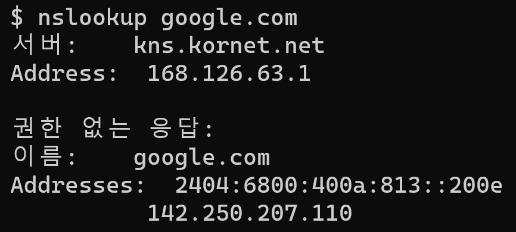

## 원인

- UnknownHostException 은 호스트 이름의 IP 주소를 확인할 수 없을 때 나타난다. 


## 해결 방법

{: width="900" height="300" .w-50 .right}
1. DNS 서버에 해당 도메인에 대한 IP주소가 잘 등록되어 있는지 확인
```
nslookup google.com
```
2. 해당 도메인이 만료되었거나, 다른 이름으로 바뀌진 않았는지 확인
3. 해당 서버 방화벽이 막혀있진 않은지 확인


<br>

---
## reference
- [java.net.UnknownHostException 에러 발생 및 해결 방법](https://boansecurity.tistory.com/12){:target="_blank"}
- [nslookup 명령어 사용법 및 예제 정리](https://www.lesstif.com/system-admin/nslookup-20775988.html){:target="_blank"}
