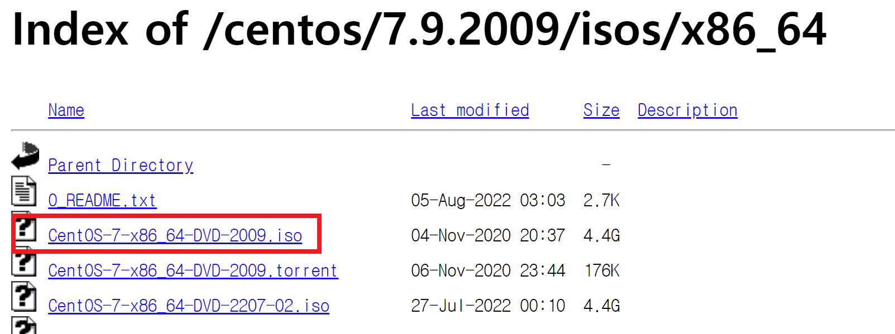
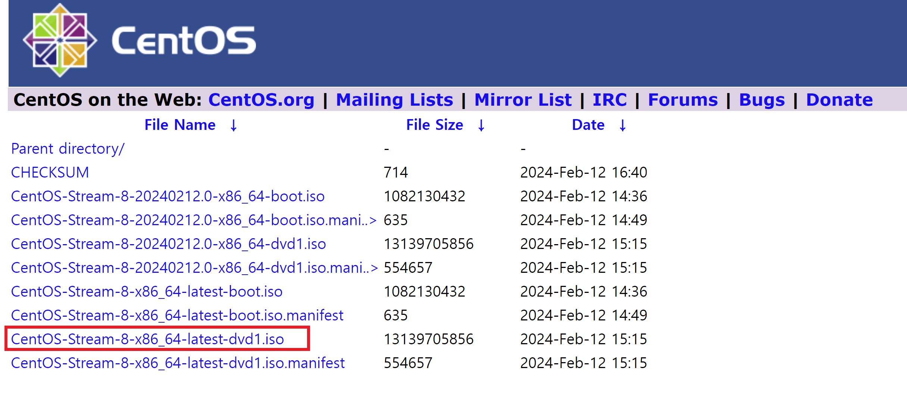
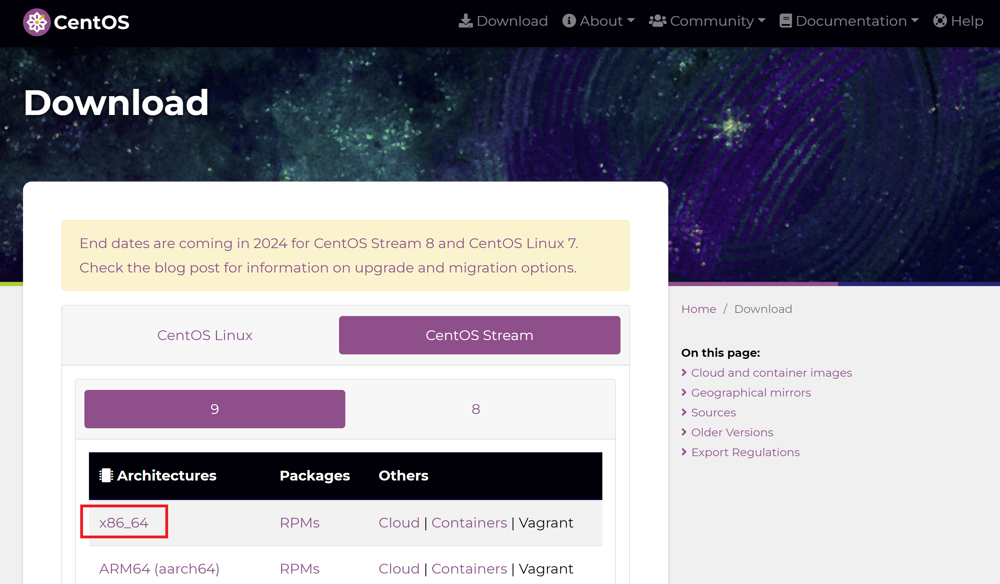
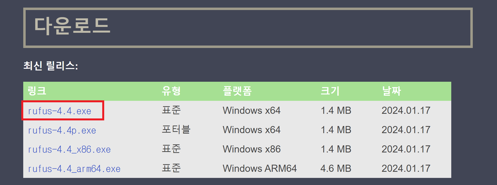
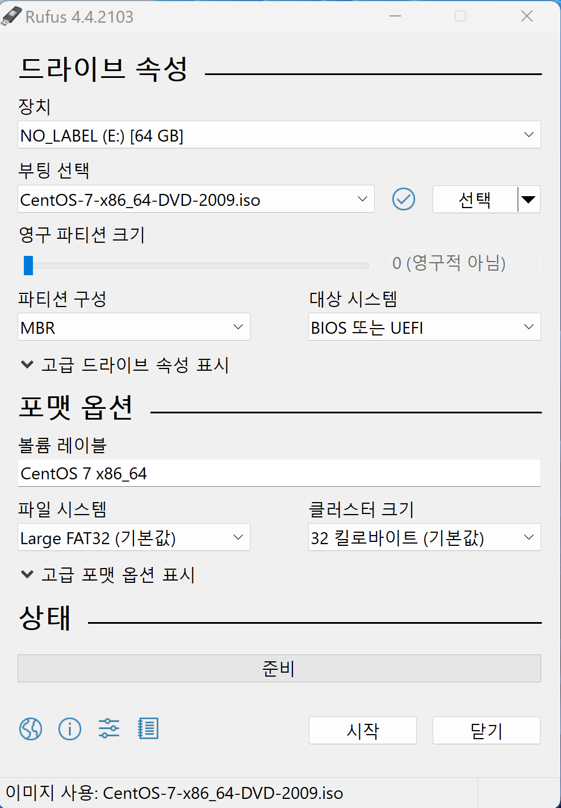
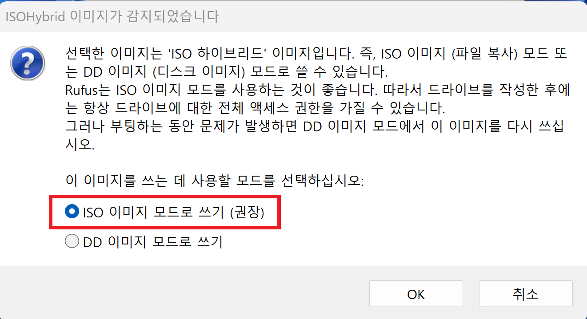
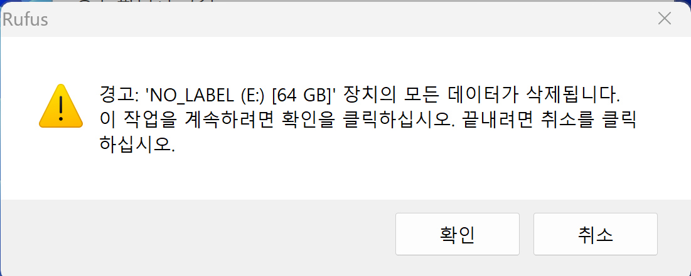
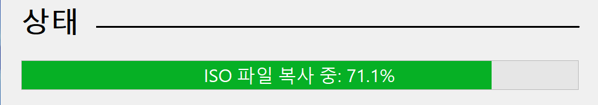
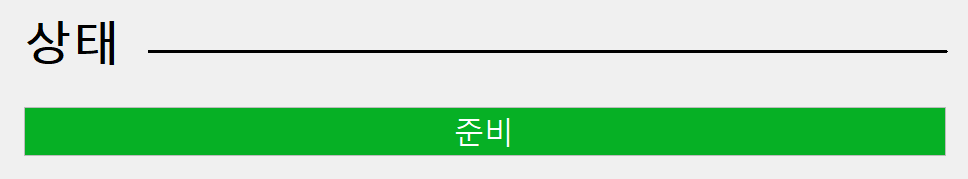

## CentOS 이미지 다운로드
원하는 Cent OS 버전의 **ISO 파일**을 다운로드 받습니다.   
ISO 파일 : 완전한 CD 또는 DVD의 이미지

- [CentOS 7 다운로드 바로가기](https://mirror.navercorp.com/centos/7.9.2009/isos/x86_64/){:target="_blank"}   
{: width="700" height="300" .shadow .w-75 .normal}
> CentOS 7 EOSL : 2024년 6월 30일
- [CentOS Stream 8 다운로드 바로가기](https://mirror.kakao.com/centos/8-stream/isos/x86_64/){:target="_blank"}   
{: width="800" height="400" .shadow .w-75 .normal}
> CentOS Stream 8 EOSL : 2024년 5월 31일
- [CentOS Stream 9 다운로드 바로가기](https://www.centos.org/download/){:target="_blank"}   
{: width="900" height="500" .shadow .w-75 .normal}

## USB 만들어주는 소프트웨어 다운로드
- rufus : 부팅 가능한 USB 플래시 드라이브나 라이브 USB를 포맷하고 제작할 수 있는 소프트웨어
- [rufus 다운로드 바로가기](https://rufus.ie/ko/){:target="_blank"}   
{: width="700" height="300" .shadow .w-75 .normal}

## CentOS USB 만들기 {: width="700" height="500" .shadow .w-50 .right}
1. 해당 PC 에 USB 연결
2. rufus 실행
3. '부팅 선택'의 '선택' 클릭
4. 다운받은 CentOS iso 파일을 선택
5. '시작' 클릭
6. 'ISO 이미지 모드로 쓰기 (권장)' 선택   
{: width="300" height="50" .shadow .w-30 .normal}
7. 경고 '확인' 클릭   
{: width="300" height="50" .shadow .w-30 .normal}
8. 파티션 삭제 및 ISO 파일 복사 진행   
{: width="300" height="50" .shadow .w-30 .normal}
9. CentOS USB 생성 완료   
{: width="300" height="50" .shadow .w-30 .normal}

## CentOS 설치하기
1. CentOS를 설치할 PC에 usd를 연결
2. PC 부팅
3. F10 눌러서 USB로 부팅 클릭
4. 원하는 대로 부팅 설정 : 설치 종류 설정, 네트워크 설정, root 계정 비밀번호 설정 등
5. 다음 클릭하여, 설치 진행
6. 설치가 완료되면, 재부팅
7. USB 제거 
8. CentOS 부팅되면 root 계정으로 로그인

 

---
## reference
- [ISO 파일이란 무엇이며 어떻게 사용합니까?](https://knowledge.ni.com/KnowledgeArticleDetails?id=kA00Z000000kEe7SAE&l=ko-KR){:target="_blank"}
- [ISO 이미지 파일로 CentOS 7.9 설치 (usb필요)](https://philiel.tistory.com/5){:target="_blank"}
- [CentOS 7 부팅 USB 만들기](https://g1-kim.tistory.com/entry/CentOS-7-CentOS-7-%EB%B6%80%ED%8C%85-USB-%EB%A7%8C%EB%93%A4%EA%B8%B0){:target="_blank"}
