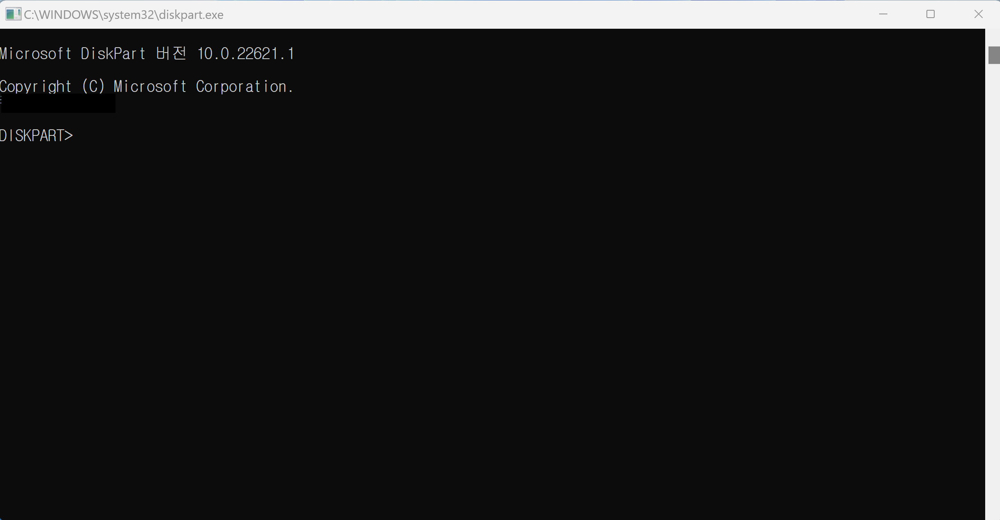

## 윈도우 CMD 창 열기

- 윈도우 검색 창에 'cmd' 혹은 '명령 프롬프트' 검색


## USB 초기화

1. 열린 cmd 창에 아래 명령어 입력
```
diskpart
```

2. 'diskpart' 명령어를 입력하면 아래와 같은 새로운 cli 창이 열림


3. 새로 열린 cli 창에서 아래 명령어 입력하여, 디스크 목록 확인
```
list disk
```

4. 조회된 dist 목록 중 초기화를 원하는 disk 를 선택 후 초기화 진행
```
sel 디스크 이름
clean
create partition primary
format quick fs=ntfs
active
exit
```

## 예시) 초기화 하고 싶은 USB가 'disk 2'일때
```
DISKPART> list disk

  디스크 ###  상태           크기     사용 가능     Dyn  Gpt
  ----------  -------------  -------  ------------  ---  ---
  디스크 0    온라인             476 GB  1024 KB        *
  디스크 1    온라인             476 GB  1024 KB        *
  디스크 2    온라인              58 GB      0 B

DISKPART> sel disk 2

2 디스크가 선택한 디스크입니다.

DISKPART> clean

DiskPart에서 디스크를 정리했습니다.

DISKPART> create partition primary

DiskPart에서 지정한 파티션을 만들었습니다.

DISKPART> format quick fs=ntfs

  100 퍼센트 완료

DiskPart가 볼륨을 성공적으로 포맷했습니다.

DISKPART> active

DiskPart에서 현재 파티션을 활성으로 표시했습니다.

DISKPART> exit
```

---
## reference
- [리눅스 설치후 USB 초기화 하는법](https://schwhitezer.tistory.com/entry/%EB%A6%AC%EB%88%85%EC%8A%A4-%EC%84%A4%EC%B9%98%ED%9B%84-USB-%EC%B4%88%EA%B8%B0%ED%99%94-%ED%95%98%EB%8A%94%EB%B2%95){:target="_blank"}
- [부팅용 usb를 만들고 다시 usb메모리로 사용하고자 할때...](https://durubiz.tistory.com/entry/%EC%83%9D%ED%99%9C%EC%A0%95%EB%B3%B4-%EB%B6%80%ED%8C%85%EC%9A%A9-usb%EB%A5%BC-%EB%A7%8C%EB%93%A4%EA%B3%A0-%EB%8B%A4%EC%8B%9C-usb%EB%A9%94%EB%AA%A8%EB%A6%AC%EB%A1%9C-%EC%82%AC%EC%9A%A9%ED%95%98%EA%B3%A0%EC%9E%90-%ED%95%A0%EB%95%8C){:target="_blank"}


